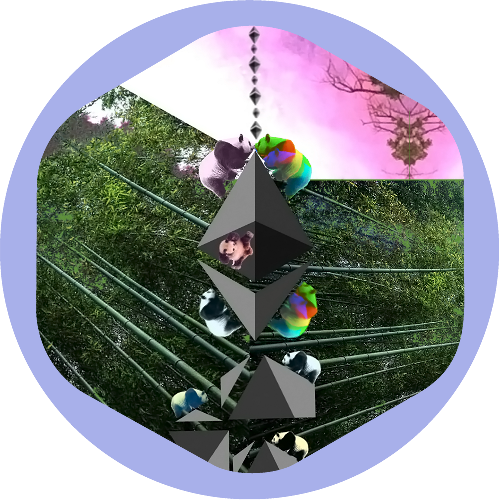

# 2022-9-15 Eth Merge

     

# Design Story
## Top

I ran with that the outline is a clock. There are 7 Ethereum logos in the POAP for 7 years of Ethereum. These logos are made up of 4 large ones and 3 small ones. The large logos as the second hand and the small logos as the hour hand on the clock. Both are at midnight symbolizing that the merge has been complete.  

## Middle

The pandas are climbing up the obstacles that the Ethereum community has overcome throughout the journey to proof of stake (POS). During the journey to POS, the POW chain was 100% up when battle tested by Crypto Kitties, Defi Summer, and The NFT Boom volume. This is symbolized by the pandas climbing up the left side and the panda bear with a high sidekick is for kicking ass and handling all that workload.  The surrounding bamboo plants are because the pandas need nutrition along the way :laughing: 

In addtion the bamboo represent EIPs that were iterated and built upon to upgrade from POW to POS. As the EIPs create a strong foundation and are woven into one another. For example [EIP 1559](https://eips.ethereum.org/EIPS/eip-1559), [EIP 3675](https://eips.ethereum.org/EIPS/eip-3675), and many more.

The pandas on the right side were working on the POS system during all these challenges.  The purple and colorful pandas meet at the top as [@SuperPhiz](https://twitter.com/superphiz?s=20&t=DKzXbNYQLIOQP0BpEFLRyw) stated: 

<blockquote class="twitter-tweet">
The merge might be more accurately described as &quot;a marriage&quot;. It&#39;s not an example of two becoming one, but rather, &quot;two getting together and sharing responsibilities&quot;. Both chains will still exist, they&#39;ll just work very closely together. A marriage.
&mdash; superphiz.eth 🦇🔊🐼 (@superphiz) <a href="https://twitter.com/superphiz/status/1567858160790114304?ref_src=twsrc%5Etfw">September 8, 2022</a></blockquote>

therefore the pandas meet in the middle like POW and POS forming a union.

## Top Right

The tree shaman on the right is for the person who got me into crypto being [@orishim](https://twitter.com/orishim?s=20&t=eIYv85skbmPXPl-vUZGLBQ) who has been leading the charge on bringing DAOs to life with [@dOrg](https://twitter.com/dOrg_tech?s=20&t=eIYv85skbmPXPl-vUZGLBQ).

The pink and white sky symbolizes [@Algovera](https://twitter.com/AlgoveraAI?s=20&t=eIYv85skbmPXPl-vUZGLBQ) and all the data science DAO has granted me with projects and a warm community.

Thank you,

Vintage Gold - https://twitter.com/vintagegold3

## Other Sources of this repo

😱💨IPFS CID - bafybeidxnpecoyq3qgtp3t4mvvjpu7tojn6pj7mgycbgpvr6v2bbdl6ike

😱💨IPFS Gateway - https://nftstorage.link/ipfs/bafybeidxnpecoyq3qgtp3t4mvvjpu7tojn6pj7mgycbgpvr6v2bbdl6ike

😱💨Local IPFS - ipfs://bafybeidxnpecoyq3qgtp3t4mvvjpu7tojn6pj7mgycbgpvr6v2bbdl6ike
